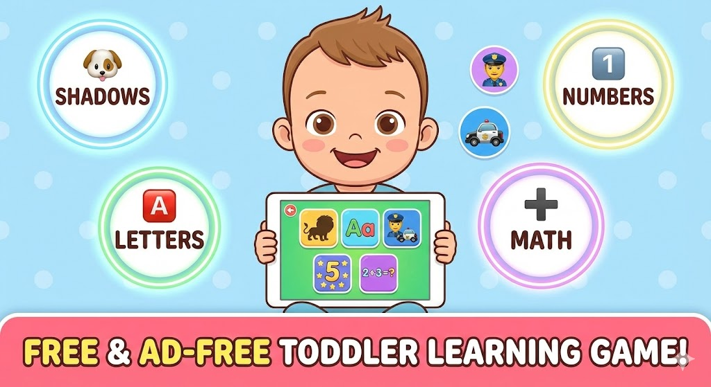

# 🦁 Toddler Learning Game

**Fun, Free & Frustration-Free!**

Welcome to a world of learning designed specifically for toddlers (ages 2-5). This game is completely **free**, **ad-free**, and safe for little ones. It works offline on any device (phone, tablet, or desktop)!

**[[🎮 Play Now!](https://ahmedashraf093.github.io/toddler-game/)]**

---

## ✨ A Growing Collection of Games

We have over 15 distinct game modes categorized to help your child develop key skills:

### 🌍 World
*   **🦁 Feed the Lion:** Learn what animals eat! Drag bananas to the monkey and bones to the dog.
*   **☀️ Weather:** Dress up characters for Sunny, Rainy, or Snowy days.
*   **🌳 Nature:** Explore the lifecycle of a butterfly and discover forest friends.
*   **🏡 Homes:** Match animals to their habitats (Who lives in the ocean? Who lives on the farm?).

### 🎨 Basics
*   **✏️ Connect the Dots:** Trace numbers (1-2-3) to reveal surprise shapes! (Fine Motor Skills)
*   **🫧 Bubble Pop:** Pop bubbles with numbers and letters. Satisfaction guaranteed!
*   **🎹 Music Maker:** Play a colorful xylophone with animal sounds.
*   **🔺 Shapes:** Learn to identify Triangles, Circles, and Squares in real-world objects.
*   **🧺 Sorting:** Tidy up! Sort items into "Animals", "Food", or "Toys".

### 📚 Learning
*   **🅰️ Letters:** Match uppercase (A) to lowercase (a) letters.
*   **🦁 Emotions:** Help the lion express feelings (Happy, Sad, Angry).
*   **📖 Story Maker:** Build simple sentences using emoji cards.
*   **👂 Listening:** "Can you find the... 🍎?" Listen and tap the right object.
*   **👮 Jobs:** Match community helpers to their tools (Firefighter → Fire Truck).
*   **➕ Math Party:** Gentle introduction to counting, addition, and subtraction.

### 🧠 Logic
*   **🧩 Puzzles:** Simple 4-piece jigsaw puzzles.
*   **🧠 Memory:** Classic card flipping memory game.
*   **❓ Odd One Out:** Find the item that doesn't belong (e.g., a car in a group of fruit).
*   **🔶 Patterns:** Complete the sequence (Red, Blue, Red, ...?).

---

## 💖 Why Parents Love It

*   **🚫 No Ads, No Tracking:** Your child's privacy is safe. No distractions.
*   **🗣️ Real Voice:** Uses friendly, natural-sounding audio sprites (no robotic browser voices!).
*   **👆 Toddler-First Design:** Large buttons, "juicy" animations, and forgiving interactions. If they drag and miss, it gently bounces back.
*   **📱 Offline Capable:** Install it as an App (PWA) on your phone and play on the airplane!
*   **🏆 Daily Challenges:** Fun little goals to encourage daily practice without addiction.

---

## 🛠️ For Developers

This project is a static **Progressive Web App (PWA)** built with love and modern web standards.

### Tech Stack
*   **Vanilla ES6+ JavaScript:** Modular architecture with no bundler required.
*   **HTML5 Canvas:** Powered the "Connect the Dots" drawing mechanics.
*   **Audio Sprites:** Custom `ffmpeg` generated sprites for instant, network-free audio.
*   **CSS3:** Heavy use of Grid, Flexbox, and Animations for a responsive, lively UI.
*   **Playwright:** Automated end-to-end testing to ensure nothing breaks for the little ones.

### Running Locally
Since it's a static app, just serve the files!
```bash
# Python 3
python3 -m http.server 8000

# Open browser to http://localhost:8000
```

## 🤝 Contributing
Got an idea for a new game? We love contributions!
1.  Fork the repo.
2.  Create a branch (`git checkout -b feature/NewGame`).
3.  Add your game module in `js/games/`.
4.  Register it in `js/main.js`.
5.  Open a Pull Request!

## 📄 License
Distributed under the MIT License. Free for everyone, forever.
